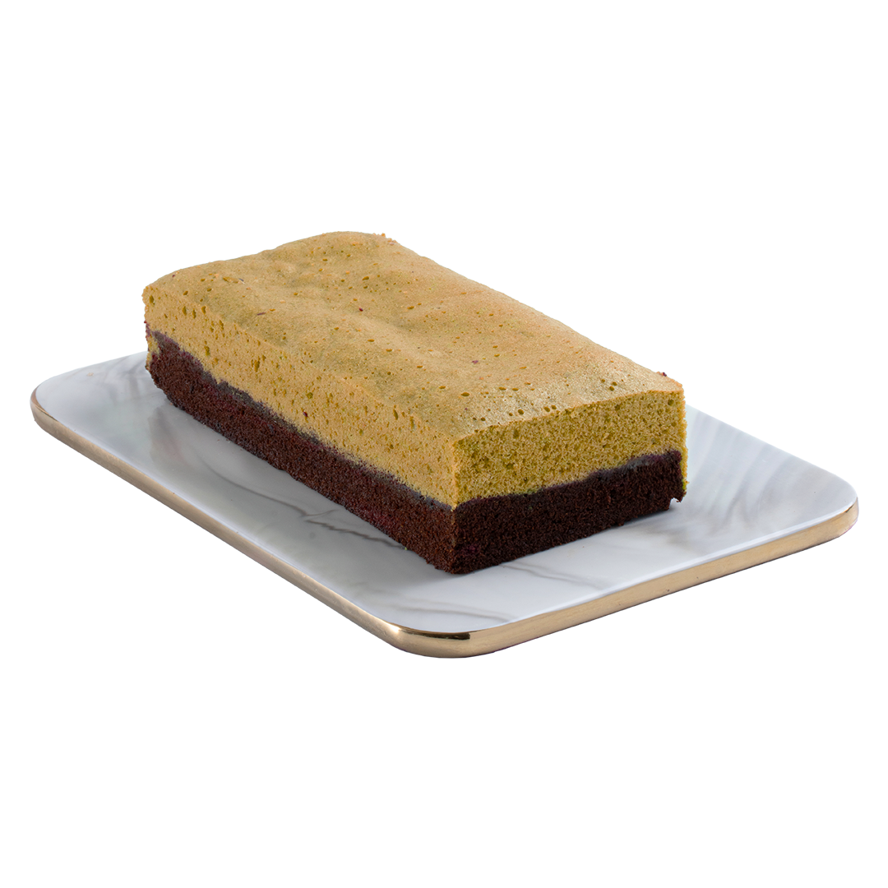
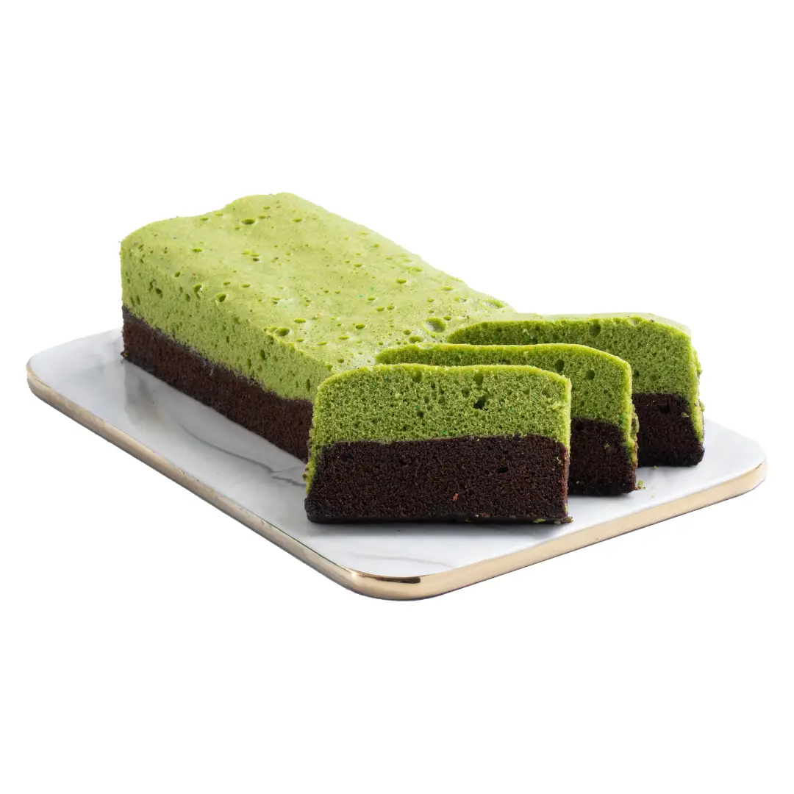
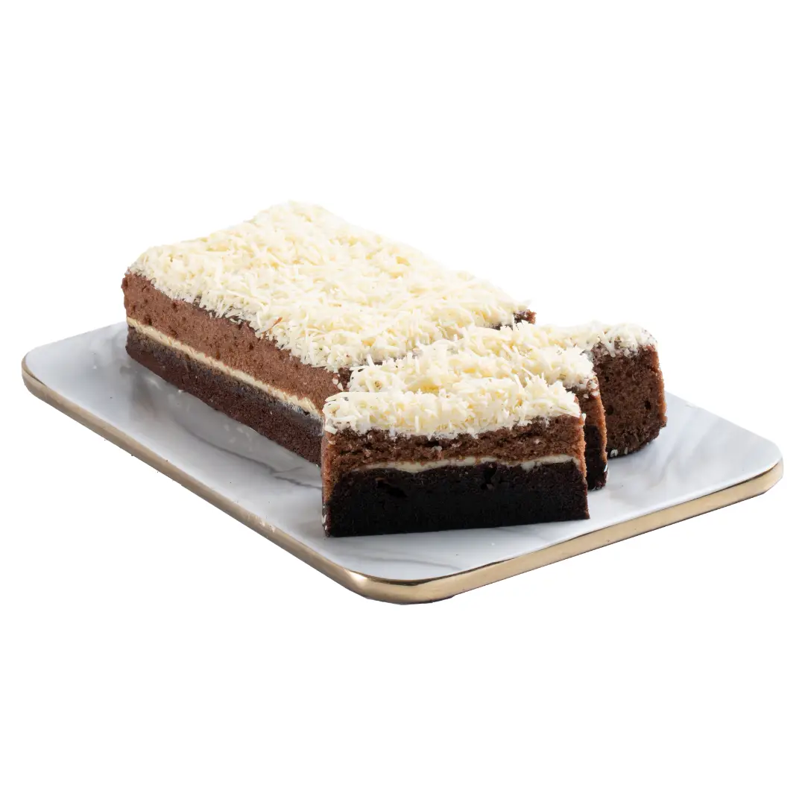
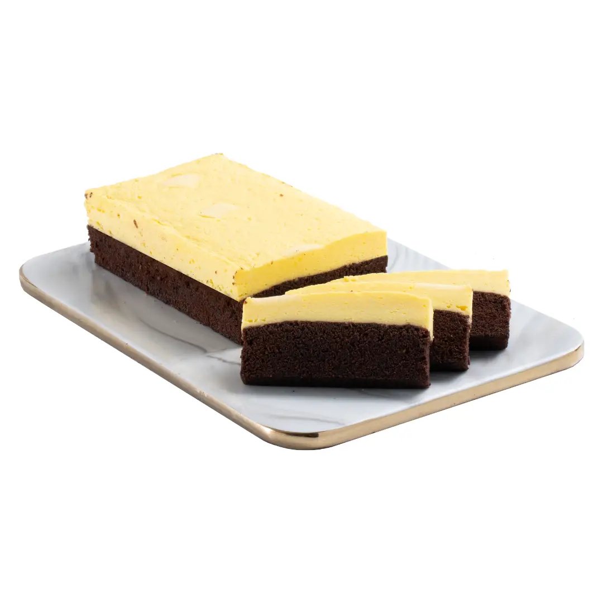

<!DOCTYPE html>
<html lang="id">
<head>
  <meta charset="UTF-8" />
  <meta name="viewport" content="width=device-width, initial-scale=1.0"/>
  <link rel="stylesheet" href="style.css">
  <link rel="stylesheet" href="https://cdnjs.cloudflare.com/ajax/libs/font-awesome/6.5.0/css/all.min.css">
  <title>BrowniesNurca</title>
</head>
<body>

  <nav class="navbar">
    <input type="checkbox" id="menu-toggle" />
    <label for="menu-toggle" class="menu-icon">&#9776;</label>
  
    

      

        <a href="#beranda">Beranda</a>
        <a href="#produk">Produk</a>
        <a href="#keranjang">Keranjang</a>
        <a href="#kontak">Kontak</a>
      

      

        BrowniesNurca
      

    

  </nav>

<section id="beranda">
  

    <h2>Deskripsi Toko</h2>
    

      

        
<strong>Brownies Nurca</strong> adalah toko kue rumahan yang berfokus pada pembuatan brownies berkualitas tinggi dengan cita rasa autentik dan tekstur lembut. Kami menggunakan bahan-bahan pilihan seperti cokelat premium, mentega asli, dan tepung berkualitas.

      

      

        
Produk unggulan kami antara lain: Brownies Original, Brownies Banana Cheese, Brownies Green Tea, Brownies Tiramisu, Dan kami juga menyediakan varian mini dan brownies kering yang cocok untuk oleh-oleh atau camilan praktis.

      

      

        
Keunggulan kami meliputi penggunaan bahan alami tanpa pengawet, proses pembuatan higienis, serta kemasan menarik untuk berbagai kebutuhan seperti hampers, acara spesial, atau oleh-oleh khas Bandung.

      

    

  

</section>

<section id="produk">
  <h2>Produk Kami</h2>
  

    

      
      <h3>Original Brownies</h3>
      
Rp50.000

       
      <button><i class="fas fa-shopping-cart"></i> Tambahkan ke Keranjang</button>
    

    

      
      <h3>Brownies Kering</h3>
      
Rp80.000

       
      <button><i class="fas fa-shopping-cart"></i> Tambahkan ke Keranjang</button>
    

    

      
      <h3>Brownies Tiramisu</h3>
      
Rp70.000

       
      <button><i class="fas fa-shopping-cart"></i> Tambahkan ke Keranjang</button>
    

    

      
      <h3>Brownies Green Tea</h3>
      
Rp80.000

       
      <button><i class="fas fa-shopping-cart"></i> Tambahkan ke Keranjang</button>
    

    

      
      <h3>Brownies Banana Cheese</h3>
      
Rp90.000

      <button><i class="fas fa-shopping-cart"></i> Tambahkan ke Keranjang</button>
    

    

      
      <h3>Brownies Cheese Cream</h3>
      
Rp100.000

      <button><i class="fas fa-shopping-cart"></i> Tambahkan ke Keranjang</button>
    

  

</section>

<section id="keranjang">
  <h2><i class="fas fa-shopping-cart"></i> Keranjang Belanja</h2>
  
Produk di keranjang:

  

    

      
      <h3>Brownies Banana Cheese</h3>
      
Rp90.000

    

    

      
      <h3>Brownies Tiramisu</h3>
      
Rp70.000

    

  

<strong>Total: Rp160.000</strong>

<button style="margin-top: 20px;">Bayar Sekarang</button>
</section>

<section id="kontak">
  <h2>Kontak Kami</h2>
  <form action="#" method="post">
    <input type="text" id="nama" name="nama" required placeholder="Nama Anda">
<input type="email" id="email" name="email" required placeholder="Email Anda">
<textarea id="pesan" name="pesan" rows="5" required placeholder="Tulis pesan Anda..."></textarea>
    <button type="submit">Kirim</button>
  </form>
</section>
<footer>
  
&copy; 2025 BrowniesNurca.All Rights Reserved.

</footer>
</body>
</html>
